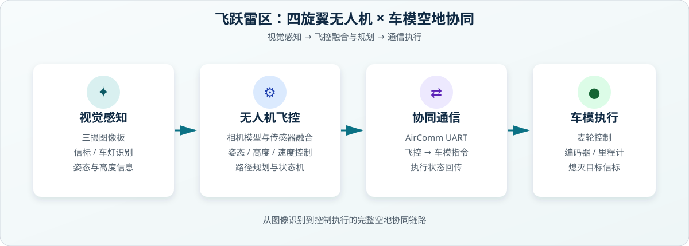

# 李文轩 | 嵌入式系统开发

你好，我是李文轩，就读于杭州电子科技大学，主要关注嵌入式系统、智能车、运动控制和传感器融合。

## 个人简介

- 第 21 届全国大学生智能汽车竞赛“飞跃雷区”组全国总决赛冠军
- 浙江省赛一等奖
- 杭州电子科技大学自动化相关专业学生
- 主要使用 C、C++、Python 进行嵌入式与工具开发
- 熟悉 AURIX、TRAVEO、STM32、ESP32、STC32/8051 等 MCU

## 全国冠军项目

### 第 21 届全国大学生智能汽车竞赛：飞跃雷区组

这是我参与的全国冠军团队项目，核心是四旋翼无人机与车模的空地协同控制。无人机识别地面信标和车灯，将视觉结果、姿态与高度信息交给飞控；飞控完成相机模型、三摄融合和路径规划，再通过通信控制车模执行。

我负责和参与的工作包括：

- 四旋翼无人机与车模的协同控制
- IMU、测距和视觉传感器数据采集
- 传感器融合、滤波和运动状态估计
- PID / 模型控制算法与飞行、车模稳定控制
- 基于视觉的信标识别、路径规划与车模执行
- 嵌入式系统调试、联调与比赛现场问题定位

系统架构：

  

项目原始团队仓库：

[HDUASC-SmartCar-21st-FlyOverMinefield](https://github.com/ZhangStudyLife/HDUASC-SmartCar-21st-FlyOverMinefield)

我的 Fork：

[HDUASC-SmartCar-21st-FlyOverMinefield](https://github.com/Even-lwx/HDUASC-SmartCar-21st-FlyOverMinefield)

> 本项目为团队项目。仓库归属团队，个人主页仅展示我的参与经历和负责内容。

## 精选项目

- [ADS124S08_RTD_Acq](https://github.com/Even-lwx/ADS124S08_RTD_Acq)：ADS124S08 温度采集与 RTD 应用
- [HookWeightModule](https://github.com/Even-lwx/HookWeightModule)：吊钩称重模块
- [ai8051-esc](https://github.com/Even-lwx/ai8051-esc)：基于 8051 的电调项目
- [lwx-smartcar2025](https://github.com/Even-lwx/lwx-smartcar2025)：智能车项目
- [PayMerge-PDF](https://github.com/Even-lwx/PayMerge-PDF)：PDF 工具项目

## 技术方向

`嵌入式 C` `C++` `Python` `FreeRTOS` `PID` `EKF` `IMU` `传感器融合` `电机控制` `计算机视觉` `STM32` `ESP32`

## 联系方式

- 邮箱：24062022@hdu.edu.cn
- 个人主页：[Even-lwx.github.io](https://even-lwx.github.io)
