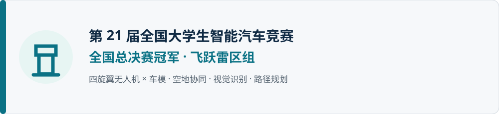
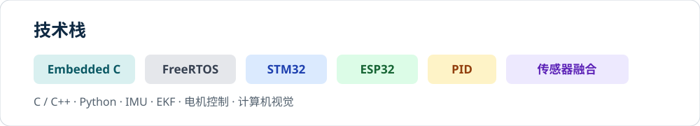

  

  
  
  

<b>杭州电子科技大学</b> · 嵌入式系统 · 智能车 · 运动控制 · 传感器融合

  <a href="#全国冠军项目">🏆 冠军项目</a>　·　<a href="#精选项目">🚀 精选项目</a>　·　<a href="#技术栈">🧰 技术栈</a>　·　<a href="#联系我">📮 联系我</a>

---

## 🏆 全国冠军项目

  

### 四旋翼无人机 × 车模：空地协同控制

第 21 届全国大学生智能汽车竞赛 **“飞跃雷区”组全国总决赛冠军**。项目由四旋翼无人机、图像板、飞控和车模组成：无人机识别地面信标与车灯，将视觉、姿态和高度信息交给飞控；飞控完成相机模型、三摄融合和路径规划，再通过通信控制车模执行。

<table>
<tr>
<td width="50%" valign="top">

**我的参与方向**

- 四旋翼无人机与车模协同控制
- IMU、测距和视觉数据采集
- 传感器融合、滤波与状态估计
- PID / 模型控制与稳定控制
- 信标识别、路径规划与车模执行
- 嵌入式调试、联调和现场问题定位

</td>
<td width="50%" valign="top">

**项目入口**

这是团队项目，仓库归属团队；个人主页展示我的参与经历与负责内容。

</td>
</tr>
</table>

  

## 🚀 精选项目

<table>
<tr>
<td width="50%" valign="top">

### ADS124S08_RTD_Acq
ADS124S08 温度采集与 RTD 应用。

### HookWeightModule
嵌入式吊钩称重模块。

</td>
<td width="50%" valign="top">

### ai8051-esc
基于 8051 的电调项目。

### lwx-smartcar2025
智能车项目实践。

</td>
</tr>
</table>

## 🧰 技术栈

  

  
  
  
  
  
  
  
  

## 📮 联系我

  
  

把想法做成能飞、能跑、能稳定工作的系统。

